```{r setup, include=FALSE}
options(htmltools.dir.version = FALSE)
```

```{r webcam, echo=FALSE, include= TRUE}
xaringanExtra::use_webcam()
```

```{r xaringan_themes, echo = FALSE, include=FALSE}
	names(xaringan:::list_css())
```

```{r broadcast, echo=FALSE}
xaringanExtra::use_broadcast()
```
background-image: url("IMG-20210726-WA0043.jpg")

# Sumário
#####Apresentação disponível em <a>https://mauritia-flexuosa.github.io/seminario_metodos</a>


1. Sistemas complexos e dinâmicos
2. Resiliência ecológica
3. Inferindo resiliência: exemplos
4. Exemplo do meu estudo
-  a) Dados de campo
- b) Dados de satélite

---
class: top, center

# Sistemas dinâmicos e complexos

.left[

### Dinâmico

- Muda com o tempo

]

.center[


]

---
class: top, left
# Problema da complexidade

.left[

### Complexo

- Formado por múltiplos elementos que interagem entre si.
]


*Modelos lineares não levam em conta interações*


---
# Solução qualitativa
## Soluções simples para problemas complexos

- Henri Poincaré: Informações a respeito do comportamento e propriedades de sistemas complexos.

.center[

]
---
# Ecosystemas são sistemas complexos e dinâmicos!

### Resiliência ecológica: Conceito que ajuda a descrever e entender a dinâmica de sistemas complexos.

- Capacidade que os sistemas possuem de absorver impactos antes de colapsar para um estado alternativo de funcionamento

- Capacidade de auto organização de um sistema (feedbacks)

.center[

C. S. Holling]

Resilience and Stability of Ecological Systems (1973):  https://www.annualreviews.org/doi/10.1146/annurev.es.04.110173.000245
---
background-image: url("https://www.ecologyandsociety.org/vol17/iss4/art48/figure2.jpg")

# Pressuposto: estados alternativos

---

# Identidade dos sistemas: variável de estado

.center[


]


---

# Estados alternativos

- Variável de estado

- Condições ambientais

.center[

]


---
# Indicadores de resiliência

.center[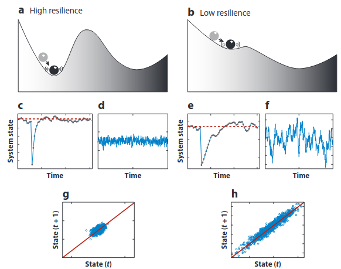]

---
# E se eu não tiver série temporal?

Substituição de tempo por espaço.

.center[  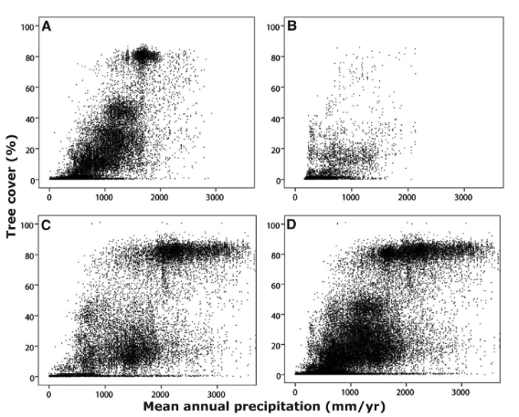

*Hirota et al, 2011 - Science*]

---
# Savannas e Florestas como estados alternativos

.center[

*Hirota et al, 2011 - Science*]

---
# Usando outras variáveis de estado 

.center[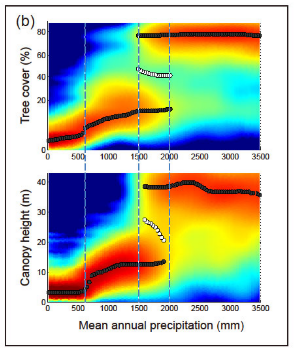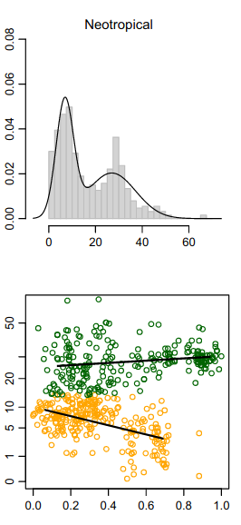

*Xu et al (2016) - Ecology*; *Dantas et al (2015) - Ecol letters*]


---
background-image: url("IMG-20210801-WA0031.jpg")
# Exemplo do meu estudo

## Florestas e savannas na mesma paisagem são estados alternativos? ( **dados de campo** e **dados de satélite**)

### Variáveis de estado são diferentes?

### Estão sob as mesmas condições ambientais?

---
### Parque Nacional da Chapada dos Veadeiros

#### Primeiro desafio: **Seleção dos pontos amostrais**

.center[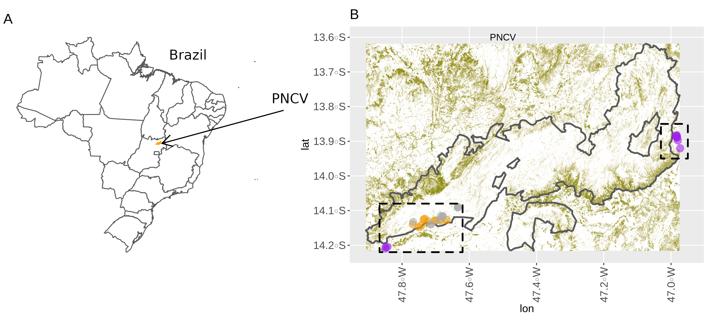]

--
Aleatorizei pontos dentro do PNCV e selecionei por cobertura do dossel.

---
 # Sobre as parcelas
 
 - Qual tamanho de parcela é ideal?
 
.center[ 
  ]

--

E se eu quiser estudar tipos de vegetação diferentes com densidade de árvores diferentes?
---

# Dados de Campo

- Exemplo de preparação para marcar as árvores amostradas.

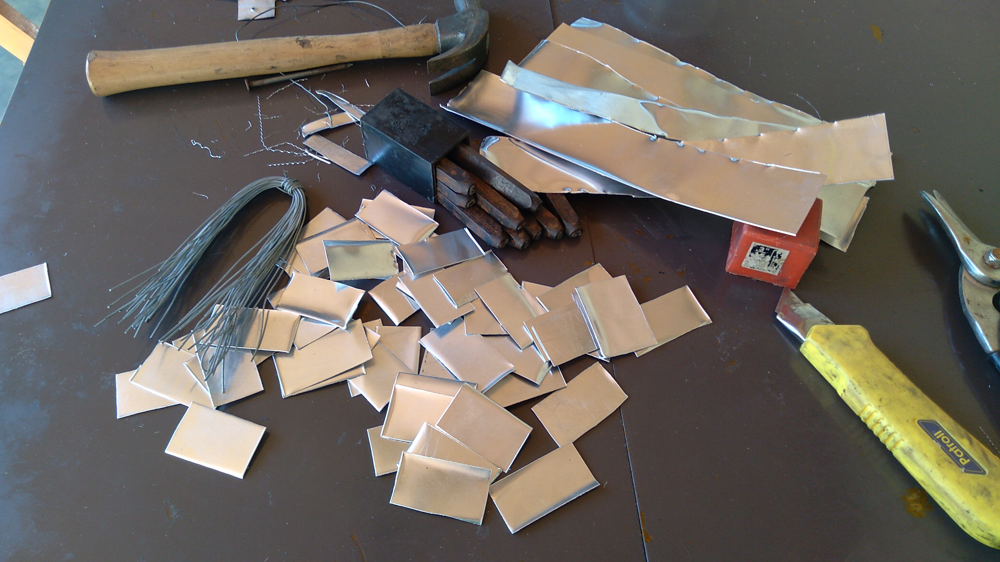
---
# Coleta de solo para análise: Caracterizar ambiente

- Solo (Análise na UFV)

.center[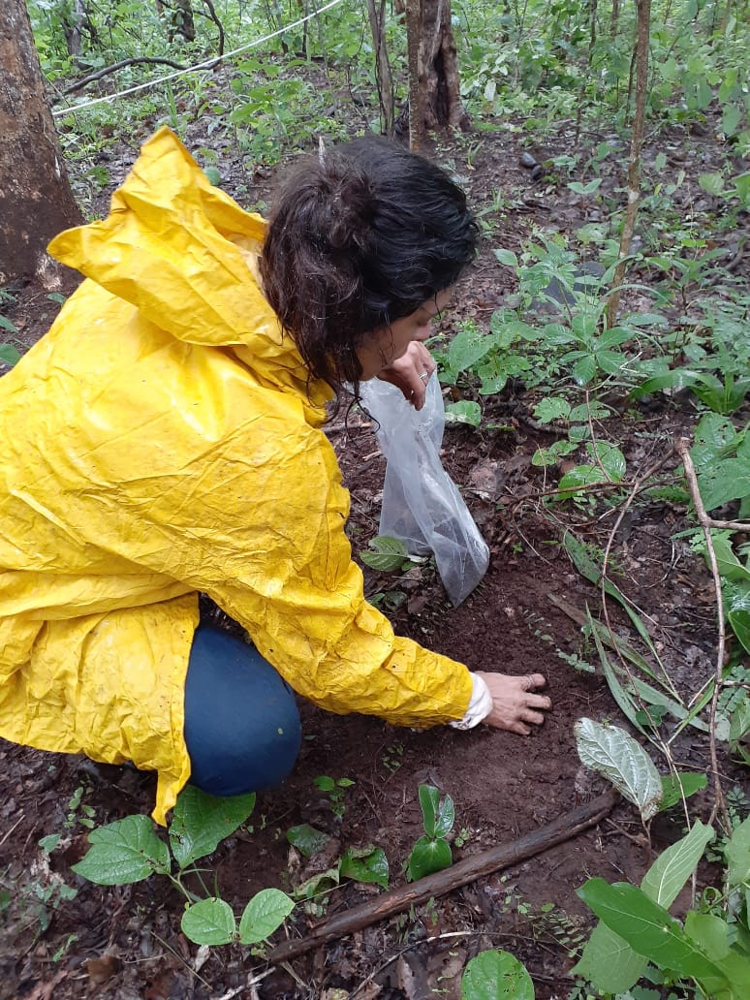]

---
# Padronizações são feitas pra usar na gringa

.center[ 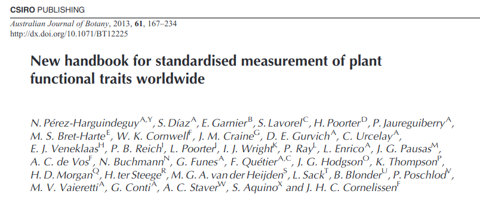]

--

- Eu poderia ter usado a curva de rarefação pra determinar o número de parcelas ou o tamanho do transecto.

--

- Mas nós determinamos 10 parcelas pra cada tipo de vegetação.

---
# Dados de campo

- Florística (identificação das espécies)

.center[
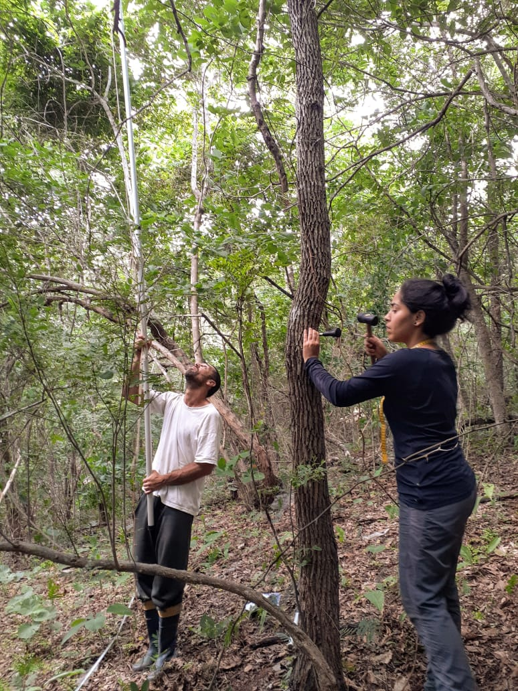]


---
# Dados de Campo

- Atributos: altura da árvore, WD, SLA, BT, BA

 .center[

]

---
# Cuidados e preparação dos dados de campo
- Fazer outros tratamentos
- Planilhar
- Análises

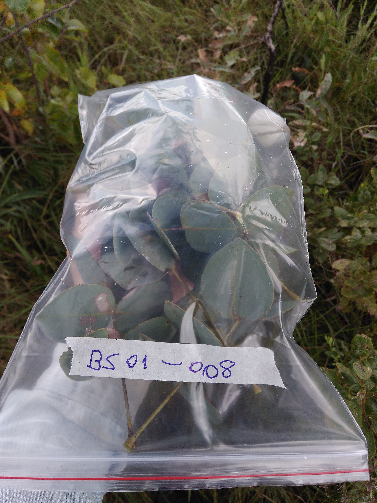
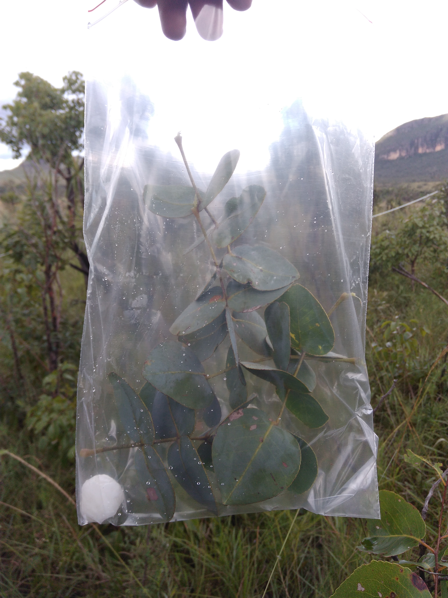
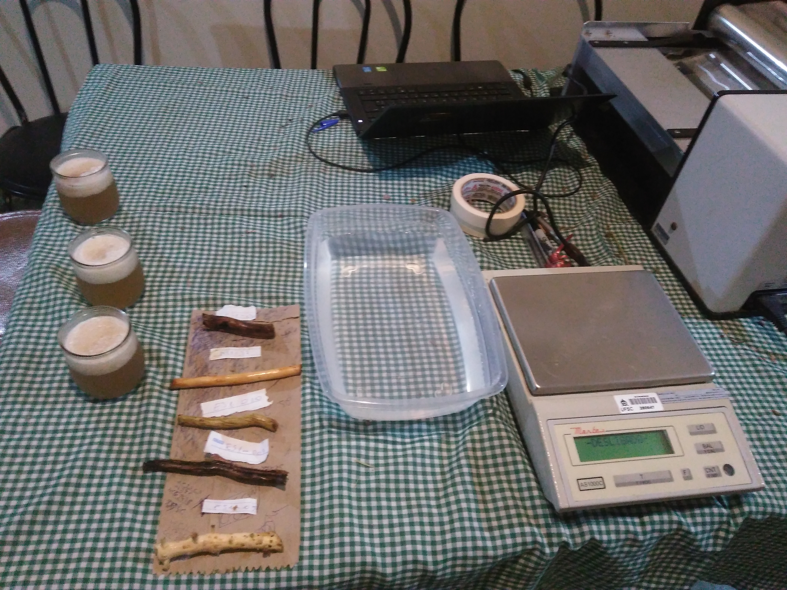

---
# Dados remotos


.center[]

---
# Acesso aos dados de satélite
[Earth Explorer](https://earthexplorer.usgs.gov/)


.center[]

---
# Acesso aos dados de satélite

[Google Earth Engine](code.earthengine.google.com/)

.center[]

---
# Acesso aos dados de satélite

- [Pacote geextract do Python](http://www.loicdutrieux.net/landsat-extract-gee/introduction.html)

.center[]

--
- E tem esse outro tb:

.center[]


---
# Precipitação

-  [CHIRPS](https://data.chc.ucsb.edu/products/CHIRPS-2.0/): precipitação

.center[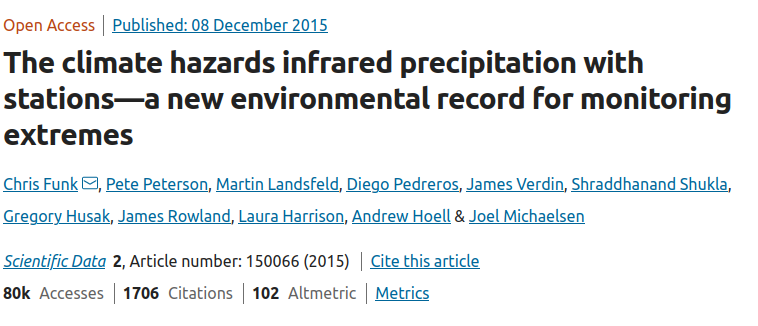]

https://www.nature.com/articles/sdata201566
---
# Mapbiomas

[Mapbiomas](https://mapbiomas.org/)

.center[]

.center[]

---
#  Campo vs Satélite
 ### Exemplo: Cobertura do dossel


.center[
]

.center[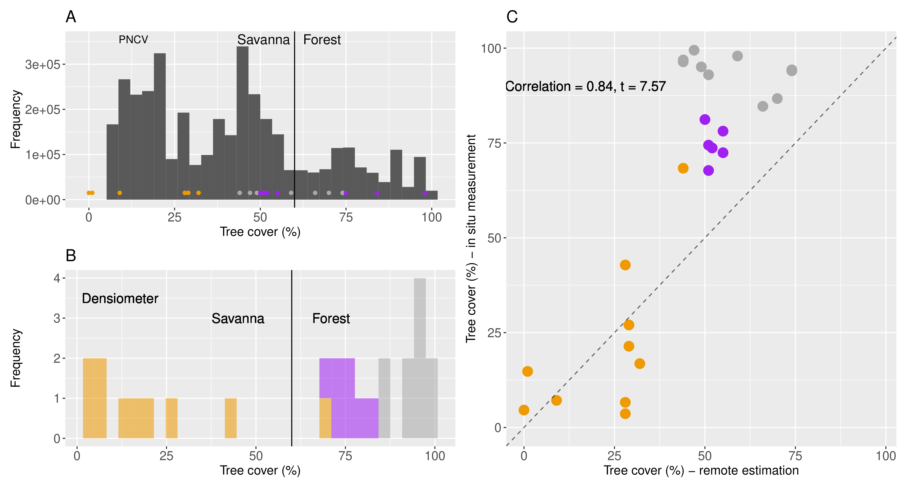]

---
# Obrigado pela atenção

Laboratório IPES - Interdisciplinary Environmental Studies (Departamento de Física - UFSC)

Email: <marciobcure@gmail.com>

[GitHub](github.com/Mauritia-flexuosa)

.center[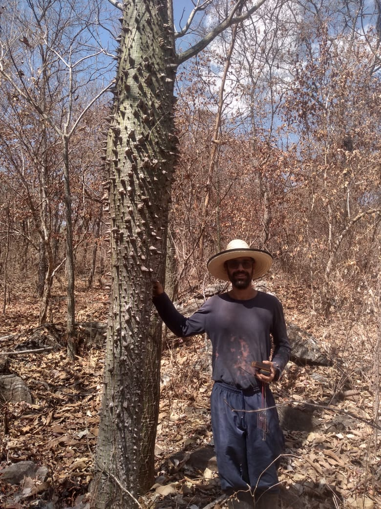]
